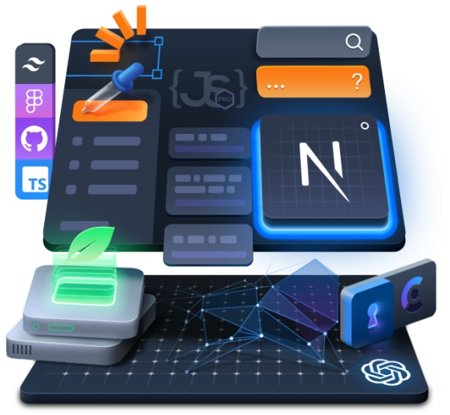
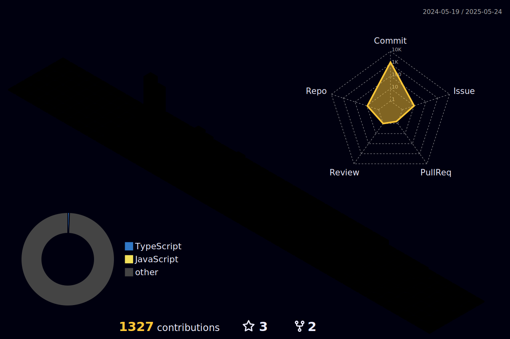

<h1 align="center">
  
</h1>

I am a highly skilled developer with a strong focus on **Solana** development, **Forex Trading** solutions, and **Full-Stack** engineering. My expertise spans building scalable, secure, and efficient systems that bridge decentralized finance (DeFi), forex trading, and modern web applications.

### 💰 Solana Development

- **Rust Programming**: Expertise in writing optimized and secure Solana programs.

- **Anchor Framework**: Proficient in using Anchor for streamlined Solana development.

- **Smart Contracts**: Skilled in designing and deploying smart contracts on Solana.

- **PDAs & Token Extensions**: Knowledgeable in managing PDAs and token extensions for Solana applications.

- **Cross-Chain Interoperability**: Experienced in integrating Solana with other blockchain networks.

### 💹 Forex Trading Solutions

- **Algorithmic Trading**: Skilled in developing algorithmic trading systems using technical indicators and machine learning models.

- **Blockchain Integration**: Expertise in integrating blockchain technology into forex trading platforms for enhanced security and transparency.

- **Automated Trading Systems**: Knowledgeable in building automated trading systems using smart contracts.

 

### 🌐 Full-Stack Development

- **Frontend Development**: Proficient in React, Angular, Vue.js and Next.js for building modern and responsive user interfaces.

- **Backend Development**: Skilled in Node.js, Express.js, and Nest.js for building robust backend systems.

- **API**: Experienced in designing and implementing RESTful APIs and GraphQL APIs.

- **Database**: Knowledgeable in working with relational databases (e.g., MySQL, PostgreSQL) and NoSQL databases (e.g., MongoDB).

- **CI/CD**: Experienced in setting up CI/CD pipelines for seamless deployment and continuous integration.

### 🔍 Additional Skills

- **Algorithmic Stablecoin Technology**: Skilled in designing stablecoin architectures with robust algorithms for maintaining price stability.

- **Python Scraping**: Proficient in using Python libraries like BeautifulSoup and Scrapy for web scraping.
  
- **Crypto Trading Bots**: Experienced in building automated crypto trading bots using CCXT library.

### 🛠 Tech skills:

My mission is to revolutionize financial systems like forex trading through blockchain technology while delivering innovative full-stack solutions that empower businesses in the decentralized economy. I aim to create impactful products that drive adoption of Web3 technologies globally.

This version focuses on highlighting your skills rather than experience or what you deliver. Let me know if you need further adjustments!

### 📞 Connect with me:

  

<h2>🏆 GitHub Trophies</h2>

  

